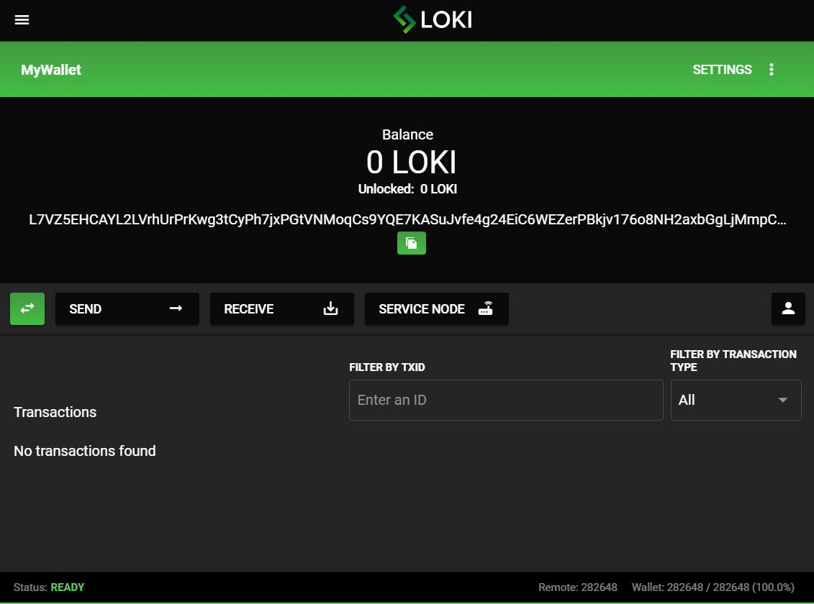
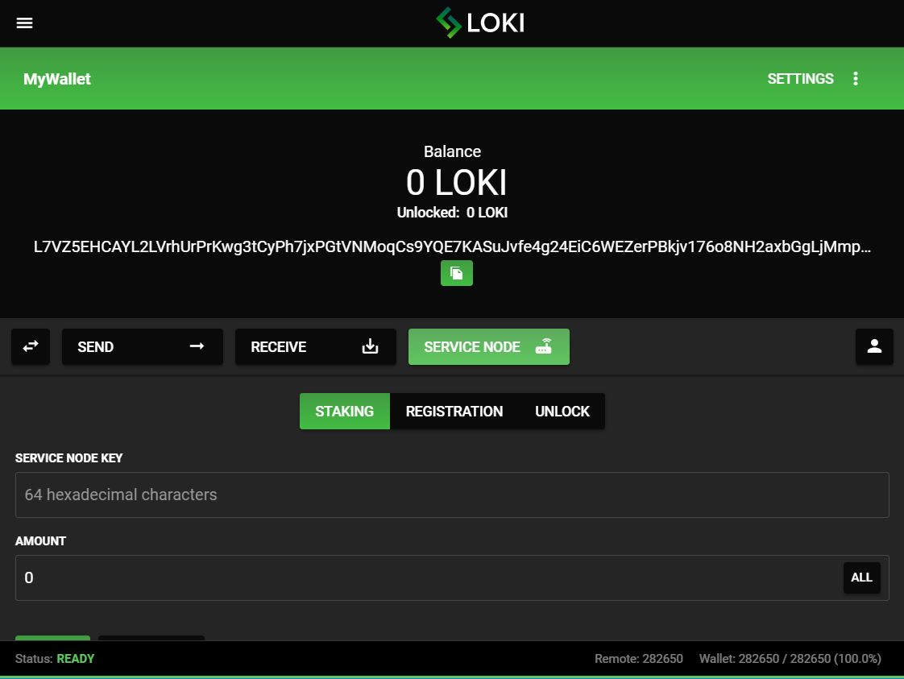
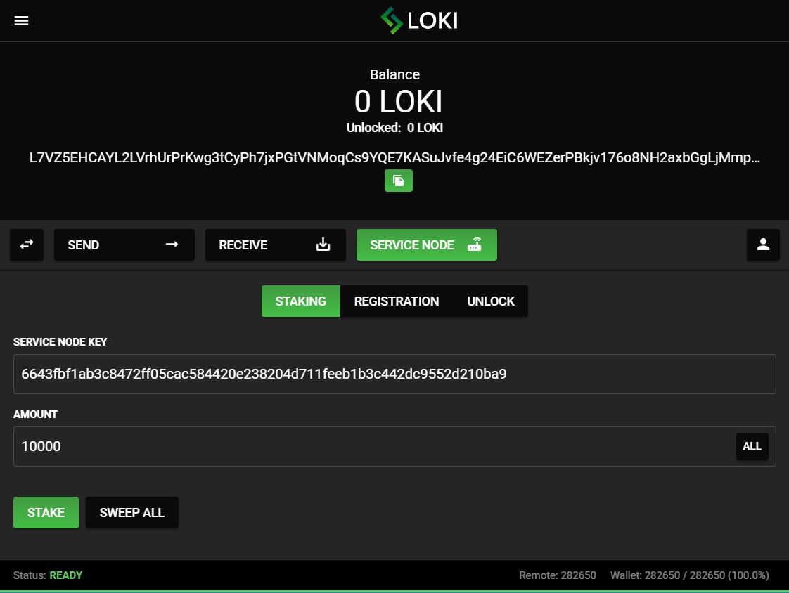

title: Loki Documentation | Monero / Loki GUI staking Guide
description: This document helps individuals stake to a Loki Service Node. Loki is a code fork of Monero and offers Service Nodes ontop of the Monero codebase. There are now a few Monero Masternode coins however the Loki Gui guide shows how easy it is to stake on the Loki Blockchain.

# GUI-Pool-Staking-Guide

This document will tell you exactly how to stake via the Loki GUI wallet.

The latest version of the wallet can be downloaded [here](https://github.com/loki-project/loki-electron-gui-wallet/releases).

Please keep in mind, one can **only stake via an open pool with the GUI wallet**. If you would like to stake your own node or a create pool, please view the full guide on service nodes [here](../SNFullGuide).

Also, this best done with a primary wallet address that is **not receiving mining transactions**. A separate primary wallet for Staking is recommended.

1) Open the wallet, enter your password, and let it fully sync to the latest blockheight.

2) Click on the `SERVICE NODE` button.

3) On this step you will need to enter the service node public key obtained from the node operator or [LokiBlocks](https://lokiblocks.com/service_nodes) and the amount of Loki you are contributing to the node.

4) Once that is filled out, simply hit the `STAKE` button.

> Please note, if you receive an error at this step you will need to click the `SWEEP ALL` before you can stake from your wallet.

5) Congratulations, you are now staking!

If you have questions or need help with this guide feel free to reach out to us on [Discord](https://discordapp.com/invite/67GXfD6) or [Telegram](https://t.me/LokiCommunity).
